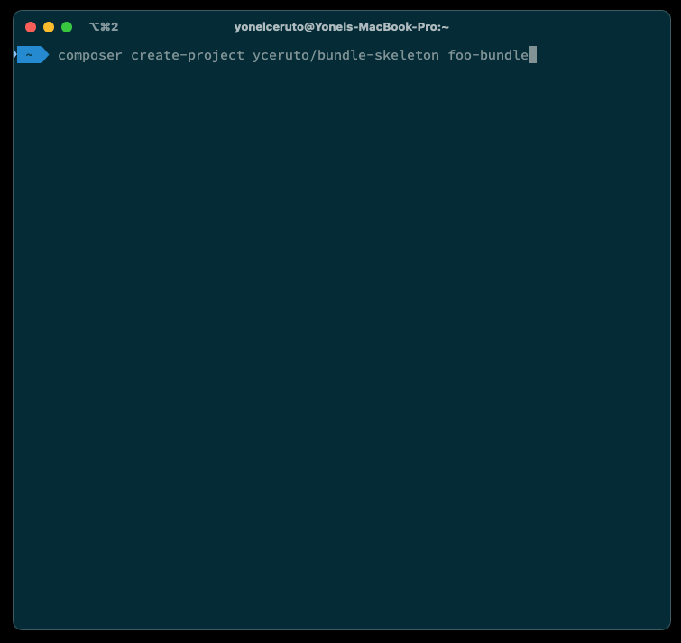

# Bundle Flex

Composer plugin for [Proclaim Honestly, Interact Liberally - Internet Platform (Symfony) Bundle Skeleton](https://github.com/parler-haut-interagir-librement/bundle-skeleton).

Base on [yceruto/bundle-flex](https://github.com/yceruto/bundle-flex) with adjustment to fit phil-ip requirements.

## Features

- Update `composer.json` file with PSR-4 namespaces.
- Generate `README.md` file with basic installation instructions.
- Generate directory structure and boilerplate files.
- Generate bundle class with basic implementation.
- Add tests
- Add Static analysis with PHPStan
- Add Coding standards with php-cs-fixer
- Add Refactoring with Rector
- Add task runner with Castor

## License

This software is published under the [MIT License](LICENSE)
